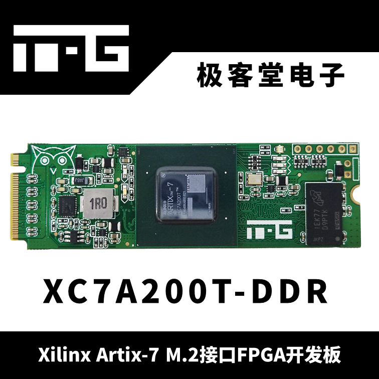
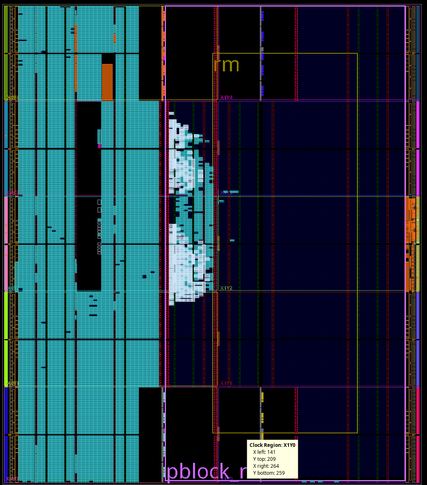

# M2 Artix FPGA Accelerator Card


**WARNING**: this repository is a major WIP. Proceed with caution.

This repository focuses on the very cheap M.2 FPGA accelerator card found on AliExpress:
https://es.aliexpress.com/item/1005006844453359.html

Namely, the version with DDR: XC7A200T-ddr

I've downloaded the documentation from pan.baidu and translated it using Google Translate. The user guide and schematic can be found in the `docs` directory.

## Build Options
With this repository you can build the following projects:
- xdma
- xdma_ddr3
- xdma_ddr3_dfx

### xdma:
This is one of the two examples provided in the user guide and, in my opinion, the easier of the two to script. This project instantiates a Block RAM that can be read over PCIe via the XDMA IP core.

The other example (which uses RIFFA) will not be included in this repo.

### xdma_ddr3:
This is a hybrid of the previous project and an example project provided in the Baidu shared folder (also not found here). It enables DDR3 using the Xilinx MIG IP core in addition to the Block RAM.

From said project I copied the DDR settings and exported the pin constraints (found in `docs/mig_ddr3_pinout.ucf`).

This project allows the DDR3 chip to be read via PCIe similar to the Block RAM.

### xdma_ddr3_dfx:
This project builds on previous examples adding a Reconfigurable Partition.

This Reconfigurable Partition takes up the majority of the FPGA with most of the previously mentioned components in the static region: XDMA, MIG, AXI Interconnect, etc.



The Reconfigurable Partition is implemented using a block design (which is has its pros and cons).

There is a top level block design that becomes the top level of the project once a Verilog wrapper is generated for it: \
`projects/xdma_ddr3_dfx/xdma_ddr3_dfx_bd.tcl`

This BD instantiates a second BD (sorry for the bad names): \
`projects/xdma_ddr3_dfx/xdma_ddr3_dfx_bdc.tcl`

The magic happens in the way the second BD is instantiated. It uses what Xilinx calls a Block Design Container.
You can read about it here: \
https://docs.amd.com/r/en-US/ug994-vivado-ip-subsystems/Introduction-to-Block-Design-Containers

This allows you to fix the address ranges and the interfaces between the static and reconfigurable regions.

The contents of the Reconfigurable Partition are somewhat unfinished here. Right now I have a Block RAM instantiated that I plan on using to test read/writes. There are also some Xilinx DataMovers I threw in there to take up space.

The Reconfigurable Partition has a Slave AXI bus and a Master AXI bus. The idea is that the Slave AXI bus is used for control (reading and writing registers) while the Master AXI bus for reading and writing to the DDR3.

I've also implemented a hierarchical block to group together the AXI Shutdown managers and DFX couplers.

## Building

### xdma and xdma_ddr3

The first two projects are built using Vivado 2021.1. Running the following will get you a bitstream:
```bash
source /opt/Xilinx/Vivado/2021.1/settings64.sh
cd project/xdma_ddr3_dfx
make
```
### xdma_ddr3_dfx

The last project is built using Vivado 2024.2 (it plays better with DFX):

#### Source Vivado:
```bash
source /opt/Xilinx/Vivado/2024.2/settings64.sh
```

#### Build Static and Reconfigurable Regions
```bash
make
```
This command will build the entire thing and provide you with the following:
- Top-level bitstream (with RP)
- Partial bitstream (only RP)
- Routed checkpoint for the top-level
- Sythesis checkpoint for RP
- Timing and power reports

#### Synthesizing the Reconfigurable Region
```bash
make synth_partitions
```
This command could use some work TBH. Currently it re-does the first half of the previous command ending with the synthesis checkpoint.

What this does is synthesize the whole thing and the provide the checkpoint for the synthesized RP module. This is to ensure that all the connections with the static region are preserved. I tried synthesizing the RP module on its own, but I always get errors with the AXI bus signals not matching up when trying to place and route with the top-level's checkpoint.

In theory, if you don't modify the top-level and keep its routed checkpoint, you shouldn't have any issues with RP being incompatible.

This command assumes you have exported the Block Design Container to TCL format. Run the following in Vivado to export TCL (make sure to only have the RP Block Design open):
```tcl
validate_design
write_bd_tcl -force -make_local -exclude_layout ../../xdma_ddr3_dfx_bdc.tcl
```

Or, if you want to use the GUI, modify the block design and synthesize. Then create a synthesis checkpoint with something like the following:
```tcl
write_checkpoint -force -cell xdma_ddr3_dfx_i/dfx_partition ../reconfigurable/dfx_partition_inst_0_synth.dcp
```

The outputs of this step will be used for the next command.

#### Implementing/Routing the Reconfigurable Region
```bash
make impl_partitions
```
This command takes the the routed static checkpoint and the synthesized reconfigurable checkpoint and builds the partial bitstream.

It does so by taking the routed top-level checkpoint and replacing the Reconfigurable Partition with a grey-box. The grey-box is then replaced with checkpoint from the previous step. You can take a peek at the following script for more details: \
`scripts/tcl/build_partitions.tcl`

Once done, it runs a check against the originally created checkpoint for compatibility using `pr_verify` and writing a bitstream when successful.

**NOTE**: The checkpoint being verified against will be updated if you build the top-level again or when you run `make`, so be mindful of that.

## Other Notes

### Non-standard PCIe Lanes
The board was designed using a reversed lane order, opposite of what Xilinx recommends. This is talked about on Section 2.5 (page 30) of the user guide.

I'm still working out how to script this. So doing it manually isn't necessary. This applies to all three projects.

**UPDATE**: I think I've almost worked out a solution. Setting the processing order to \"early\" of a constraints file with the correct lane order and then changing the IP core's constraints file to \"normal\" seems to work. For some reason, however, building the `xdma_ddr3` project the first time doesn't take the early constraints. If you rebuild from the GUI again it uses them correctly. The other two projects seems to work every time.

This can be verified using the following command when viewing the implemented design:
```tcl
get_property LOC [get_cells {xdma_ddr3_i/xdma_0/inst/xdma_ddr3_xdma_0_0_pcie2_to_pcie3_wrapper_i/pcie2_ip_i/inst/inst/gt_top_i/pipe_wrapper_i/pipe_lane[3].gt_wrapper_i/gtp_channel.gtpe2_channel_i}]
```

It should return: `GTPE2_CHANNEL_X0Y7`
