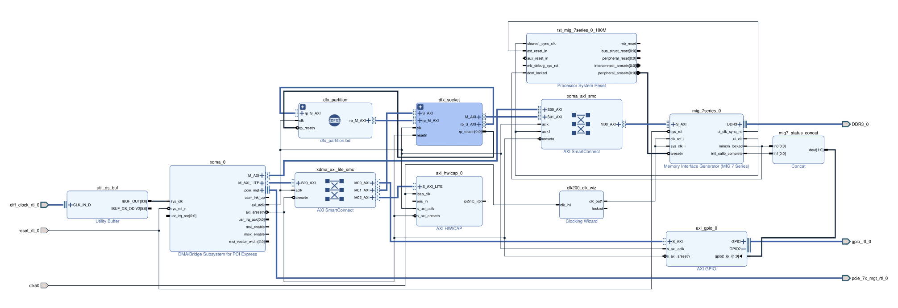
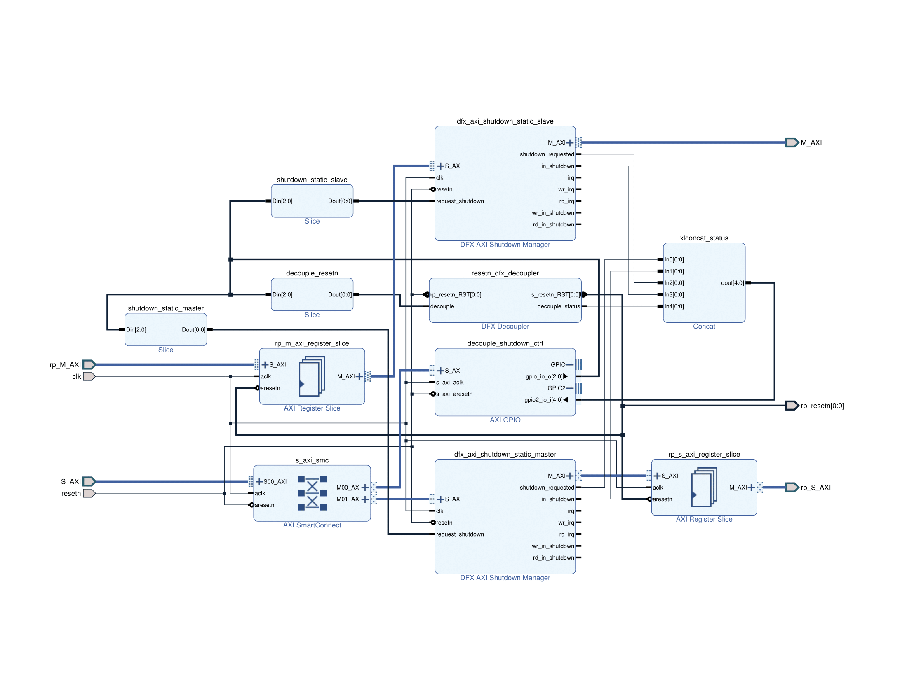
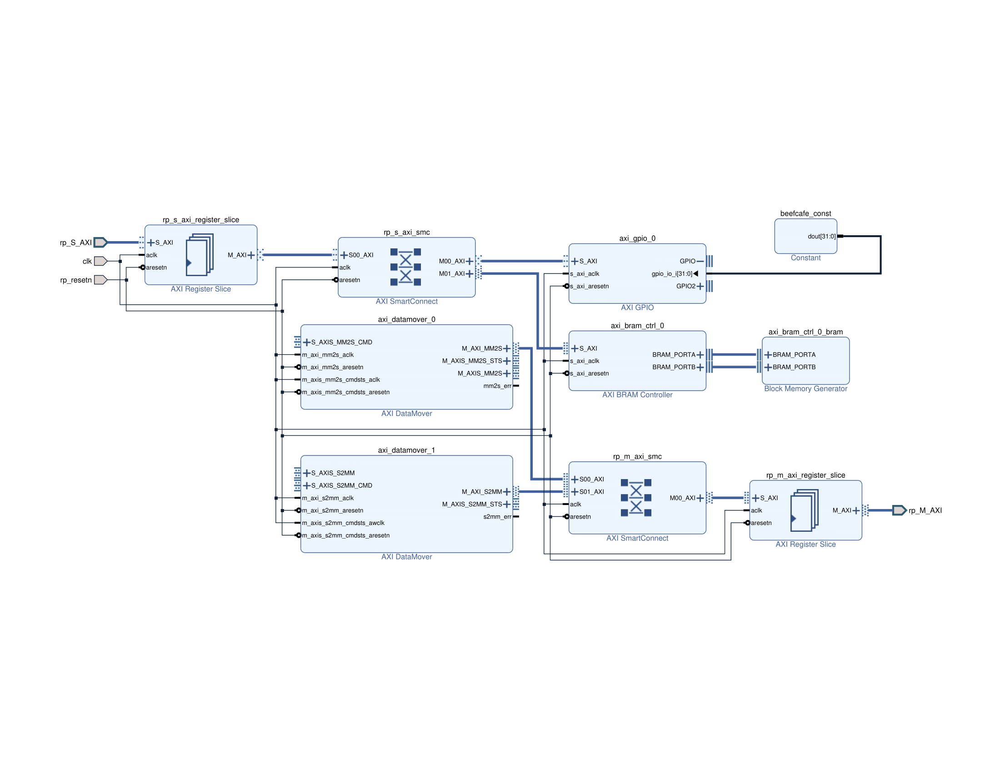

# xdma_ddr3_dfx

I'll try to summarize everything going on in this project here.

## Top-level Block Design

At a high level, the top-level is responsible for instantiating the following:
- **XDMA IP core**: this makes the whole design accessible via PCIe
- **MIG 7-series IP core**: this allows access to DDR3 via PCIe and Reconfigurable Partition
- **AXI HWICAP IP core**: this provides partrial bitstream reconfiguration via PCIe using driver in `app/hwicap_write_bitstream` 
- **DFX Socket (hier block)**: this grouping of IPs ensures the Reconfigurable Partition can be safely reprogrammed
- **DFX Partition (block design container)**: this block design is where all the fun stuff will happen

The other IPs are more or less for support:
- **SmartConnects**: these just route M_AXI_LITE, M_AXI and S_AXI interfaces
- **Clocking Wizard**: provides the MIG7 IP with a 200 MHz
- **AXI GPIO**: provides write access to LEDs and read access to MIG7 status

## dfx_socket (Hierarchical Block)

This portion of the design is responsible for 3 things:
- Shutting down RP's master AXI bus
- Shutting down RP's slave AXI bus
- Decoupling RP's resetn line

There are a few things that act as support, but are also important:
- **AXI Register Slices**: these "lock" the interfaces down so they are kept consistent. Very important.
- **AXI GPIO**: this provides individual control of shutdown and decouple lines and read access to IPs status lines

The idea is you'd follow this sequence when reprogramming an RP:
- Disengage the RP by shutting down the AXI buses and decoupling the reset
- Write a partial bitstream to HWICAP
- Re-engage the RP by clearing the shutdown and decouple registers

## dfx_partition (Block Design Container)

**Note**: This portion is still under work.

With that said, this should practically be a playground to do whatever you want. As long as you don't modify the interfaces going in and out of this block design container.

Important things to mention:
- **Address Range**: the SmartConnect in the static region needs to be informed of the range the RP will need
    - Don't randomly address AXI mapped IPs
- **AXI Register Slices**: these serve the same purpose as those in `dfx_socket` and shall **always** match settings
    - Don't remove these or change their settings.

### Future Plans

Add the following:
- MM2S DataMover control module
- S2MM DataMover control module
- Multiply-add module

With those a demo of the following could be made:
- Write a buffer to DDR3 via PCIe
- RP will read from DDR3 buffer and perform some operation on it
- RP will write result to DDR3 buffer
- Read a buffer from DDR33 via PCIe

Loads of hardware accelerated activities can be performed with these.
